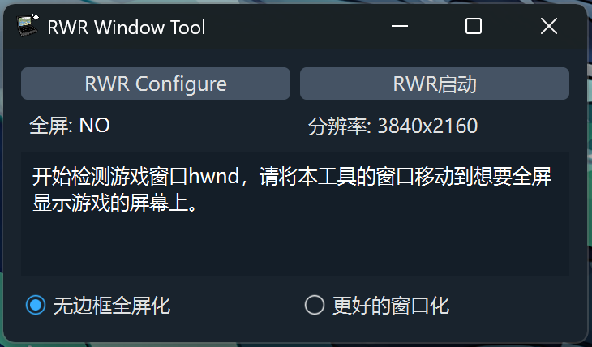
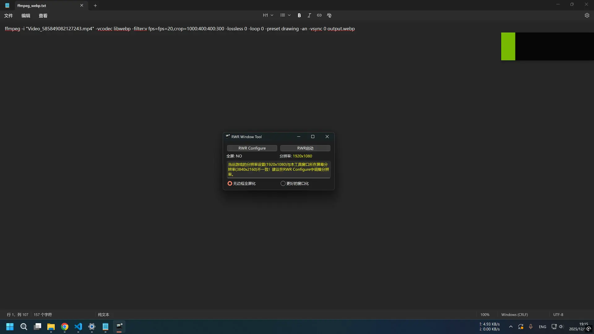

# rwndt

rwndt (RWR Window Tool) can automatically detect RUNNING WITH RIFLES game windows and set them to either borderless fullscreen or better window mode.

In borderless fullscreen mode, the tool will set the game window to a borderless fullscreen style. The game can be switched directly to other desktop windows without going through black screen or screen flickering, which is extremely useful for game development and in-game chat scenarios. Meanwhile, the tool will automatically select the target screen for borderless fullscreen output based on the position of the tool window, which is useful when you have multiple screens.

In better window mode, the tool will disable the maximize and resize functions of the game window, since the game does not support these functions. It will also switch the game window's title bar to dark mode to make it more color-coordinated with the game.

# Demo

<div align=center></div>
<details><summary>Borderless fullscreen demo</summary>
<div align=center></div>
</details>
<details><summary>Better window demo</summary>
<div align=center></div>
</details>
<details><summary>Configure demo</summary>
<div align=center></div>
</details>

# Usage

1. Download [latest release](https://github.com/yzb2288/rwndt/releases/latest) and extract it in any directory. / Download the source with `git clone` ([Run Script](#run-script)).
2. Run the rwr_window_tool exe. / Install requirements and run `main.py` ([Run Script](#run-script)).
3. Check if the game settings are configured properly according to the tool's prompts. If not, open RWR Configure to change your settings.
4. Select borderless fullscreen or better window mode and start RWR game. For borderless fullscreen mode, you need to move this tool's window to the screen where you want the game to run in fullscreen before starting game.

# Run Script<a id="run-script"></a>

```
git clone https://github.com/yzb2288/rwndt.git
cd rwndt
pip install PySide6 pywin32 vdf qdarkstyle lxml
python main.py
```

# Build

```
pip install Nuitka
python build.py
```

# Translate

```
git pull --rebase
# run this script to create .ts translation file of your locale
python utils/make_ts_qm.py
# translate in linguist.exe, and run this script again to create .qm file
python utils/make_ts_qm.py
```
